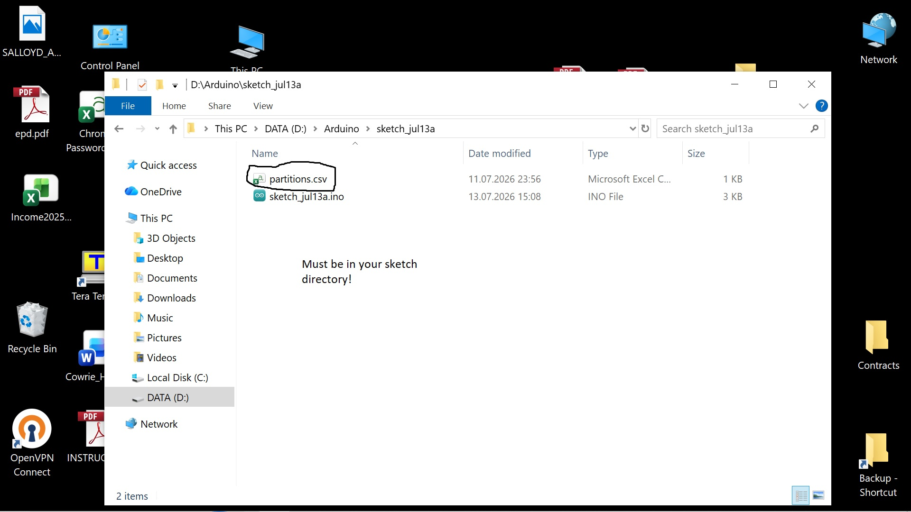
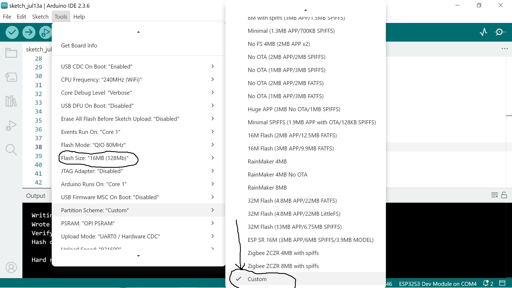

# Создание образа файловой системы TARFS

TARFS хранит файловую систему в виде обычного архива POSIX TAR.
Никаких специальных утилит для создания образов не требуется — достаточно стандартной GNU `tar`, с помощью которой можно создавать, изменять и распаковывать образы TARFS.


## Быстрый старт

### 1. Создайте каталог файловой системы

Создайте каталог, который станет корнем файловой системы. Его имя одновременно станет точкой монтирования.

Например:

```text
tarfs/
```

### 2. Заполните файловую систему

Скопируйте в этот каталог нужные файлы, подкаталоги, символические ссылки, жёсткие ссылки или (в Windows) точки соединения каталогов (directory junctions).

Для максимальной производительности (как по скорости, так и по расходу памяти) рекомендуется использовать относительно короткие имена файлов и каталогов (желательно не длиннее 100 байт).

Ограничений на длину имени или используемую кодировку нет, однако короткие ASCII-имена позволяют получить наиболее компактную и эффективную файловую систему.

> **Примечание**
>
> Будьте осторожны при создании символических ссылок с длинными именами в UTF-8. В зависимости от локали системы утилита `tar` может заменить не-ASCII символы на `???` внутри архива. Это ограничение самой программы-архиватора, а не TARFS.

Пример структуры файловой системы:

```text
tarfs/
├── www/
│   └── index.html
└── ftp/
    └── pub/
        ├── drivers.tgz
        ├── docs.tgz
        └── runme!.exe
```

### 3. Создайте TAR-архив

Выполните команду:

```sh
tar -cf tarfile.tar tarfs
```

Она создаст архив `tarfile.tar` из каталога `tarfs`.

### 4. Запишите архив во флеш-память

Запишите `tarfile.tar` в соответствующий раздел ESP с помощью `esptool`.


В ESP32 файловая система TARFS хранится в отдельном разделе Flash-памяти.

Для этого необходимо добавить соответствующий раздел в файл `partitions.csv`, после чего записать TAR-архив в этот раздел с помощью `esptool.py`.
Если вы пользуетесь средой Arduino IDE, то файл `partitions.csv` должен находиться в каталоге вашего проекта, вместе с исходным кодом:



В настройках же IDE следует указать раскладку флеша - `custom`



  1. Создайте раздел TARFS

Добавьте в `partitions.csv` раздел типа `data`.

Пример для 16MiB флеш, под файловую систему отдано примерно 13 мегабайт:

```csv
# Name,   Type, SubType, Offset,  Size, Flags
nvs,      data, nvs,     0x9000,  0x5000,
otadata,  data, ota,     0xe000,  0x2000,
app0,     app,  ota_0,   0x10000, 0x300000,
tarfs,    data, 0xF0,     0x310000,0xCE0000,
```

Поля имеют следующее назначение:

| Поле | Описание |
|------|----------|
| **Name** | Имя раздела. Используется при монтировании файловой системы. |
| **Type** | Должно быть `data`. |
| **SubType** | Любое значение для разделов типа `data`. Рекомендуется использовать `0xF0`. |
| **Offset** | Адрес раздела во Flash-памяти. |
| **Size** | Максимальный размер TAR-архива. |

Размер раздела должен быть не меньше размера создаваемого TAR-архива.


  2. Запишите образ во Flash

Запишите архив в раздел TARFS:

```sh
esptool.py --chip esp32 \
    --port COM5 \
    --baud 921600 \
    write_flash \
    0x310000 tarfile.tar
```

для Windows,

или

```sh
esptool.py \
    --chip esp32 \
    --port /dev/ttyUSB0 \
    --baud 921600 \
    write_flash \
    0x310000 tarfile.tar
```

для Linux.

Замените:

- `COM5` или `/dev/ttyUSB0` — на имя последовательного порта;
- `0x310000` — на адрес раздела, указанный в `partitions.csv`.


---

# Переписывание путей и ссылок

В зависимости от платформы и версии `tar` архив может содержать абсолютные пути или абсолютные адреса символических ссылок.

Например, вместо:

```text
tarfs/file.txt
```

в архив может попасть:

```text
/home/user/work/project/tarfs/file.txt
```

В этом случае TARFS воспримет каталог `/home` как корень файловой системы вместо `tarfs`.

Похожая ситуация возможна и в Windows (особенно при использовании Cygwin), где символические ссылки могут выглядеть так:

```text
/??/C:/Users/John/tarfs/link_name
```

вместо:

```text
tarfs/link_name
```

Для решения этой проблемы TARFS предоставляет необязательный параметр монтирования:

* `link_rebase`

Он задаёт префикс пути, который будет отрезан при монтировании файловой системы.

Например,

```text
link_rebase = "/??/C:/Users/John"
```

преобразует

```text
/??/C:/Users/John/tarfs/link
```

в

```text
/tarfs/link
```

---

# Выбор точки монтирования

Точка монтирования определяется автоматически по содержимому архива, но может быть так же задана вручную.
ВНИМАНИЕ: если файловая система окажется повреждена, то автоматическое определение точки монтирования может
не работать, поэтому, всегда следует указывать точку монтирования вручную, по крайней мере на "боевом" устройстве.

Для корректного автоопределения точки монтирования всегда создавайте корневой каталог (как описано в шаге 1), а затем размещайте внутри него всё содержимое файловой системы -
имя этого каталога и станет точкой монтирования. В случае, если такая логика работы не подъодит, точка монтирования может быть переопределена
при вызове функции tarfs_mount().

---

# Контроль целостности данных

TARFS поддерживает необязательную проверку целостности файловой системы, полностью сохраняя совместимость со стандартными TAR-архивами.

По умолчанию защищаются только заголовки TAR (метаданные inode). Каждый заголовок содержит стандартную 
контрольную сумму TAR, благодаря чему TARFS может обнаружить повреждение метаданных во время монтирования 
без каких-либо собственных расширений формата.

Если требуется более надёжная проверка, можно воспользоваться утилитой `tarsum`:

```sh
./tarsum input.tar [output.tar]
```

Она записывает дополнительный 8-байтный хеш в неиспользуемую область заполнения каждого TAR-заголовка. 
Хеш вычисляется на основе CRC64/ECMA182 и полностью незаметен для обычных TAR-утилит, поскольку эти байты 
игнорируются форматом TAR.

При монтировании архива, обработанного `tarsum`, TARFS автоматически обнаруживает встроенные хеши и 
проверяет целостность файловой системы. Эту проверку можно отключить, если важнее минимальное время 
монтирования. Проверку файловой системы можно запустить вручную, для этого используется API `tarfs_fsck()`


```c
tarfs_fsck(const char *partition_label);
```

---

# Восстановление после повреждений

В отличие от традиционных файловых систем, зависящих от центрального суперблока, TARFS рассматривает архив как последовательную магнитную ленту, а не как единый монолитный образ файловой системы. Как, собственно, и задумывалось создателями Tape ARchive.

Если во время монтирования встречается повреждённый фрагмент (т.е. "разрыв ленты"), процесс не завершается ошибкой. Вместо этого TARFS продолжает поиск вперёд, пока не найдёт следующий корректный TAR-заголовок, после чего обработка архива продолжается.

Благодаря этому даже сильно повреждённые образы остаются частично работоспособными: повреждённые файлы становятся недоступны, но все неповреждённые файлы, расположенные после повреждённого участка, по-прежнему доступны.

Попытка доступа к поврежденным данным будет заканчиваться или ENOENT, если поврежден заголовок TAR, или EIO если поврежден сам файл.

